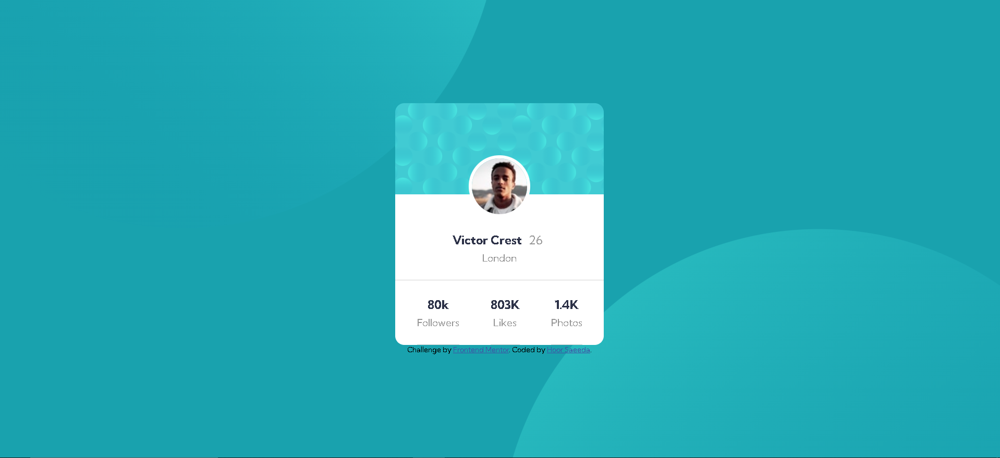

# Frontend Mentor - Profile card component solution

This is a solution to the [Profile card component challenge on Frontend Mentor](https://www.frontendmentor.io/solutions/profilecardcomponentmain-hyFbSzHuVb). Frontend Mentor challenges helped me to improve my coding skills by building realistic projects. 

## Table of contents

- [Overview](#overview)
  - [The challenge](#the-challenge)
  - [Screenshot](#screenshot)
  - [Links](#links)
- [My process](#my-process)
  - [Built with](#built-with)
  - [What I learned](#what-i-learned)
  - [Continued development](#continued-development)
  - [Useful resources](#useful-resources)
- [Author](#author)
- [Acknowledgments](#acknowledgments)

## Overview

### The challenge

- Build out the project to the designs provided

### Screenshot




### Links

- Solution URL: [https://www.frontendmentor.io/solutions/profilecardcomponentmain-hyFbSzHuVb](https://www.frontendmentor.io/solutions/profilecardcomponentmain-hyFbSzHuVb)
- Live Site URL: [https://github.com/hoor23/profile-card-component-main.git](https://github.com/hoor23/profile-card-component-main.git)

## My process

### Built with

- Semantic HTML5 markup
- CSS custom properties
- Flexbox
- Mobile-first workflow
- Google Fonts


### What I learned
- CSS Variables

```
:root{
  --fade-color:hsl(0, 0%, 59%);
  --bag-color:hsl(185, 75%, 39%);
  --text-color:hsl(229, 23%, 23%);
  --main-bg-color:hsl(0, 0%,100%);
}
```
- Use of 'Background' image 

```
body{
  background: var(--bag-color);
  min-height: 100vh;
  width: 100%;
  background-image: url("images/bg-pattern-top.svg"), url("images/bg-pattern-bottom.svg");
  background-position: right 37vw bottom 44vh , left 37vw top 36vh;
background-repeat: no-repeat;
display: flex;
justify-content: center;
flex-direction: column;
align-items: center;
font-family: 'Kumbh Sans', sans-serif;
}
```

### Useful resources

- [W3Schools](https://www.w3schools.com/css/css_align.asp) - This helped me in the implementation of multiple background images.


